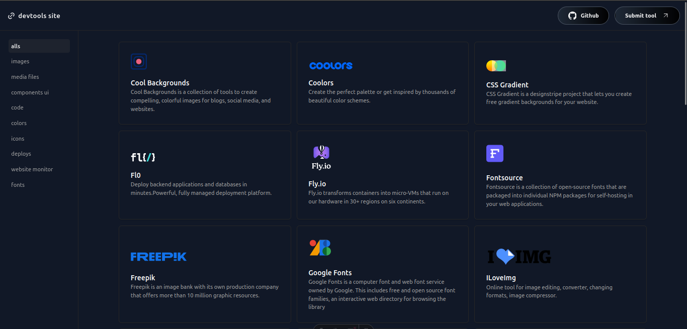

<div align="center">
<a href="https://svgl.app">

</a>
<p></p>
</div>

<div align="center">
    <a href="#" target="_blank">
        Discover
    </a>
    </a>
    <span>&nbsp;✦&nbsp;</span>
    <a href="#-getting-started">
        Submit tool
    </a>
</div>

</p>

<div align="center">


</div>

## 🛠️ Stack

- [**Astro**](https://astro.build/) - The web framework for content-driven websites
- [**Typescript**](https://www.typescriptlang.org/) - JavaScript with syntax for types.
- [**Tailwindcss**](https://tailwindcss.com/) - A utility-first CSS framework for rapidly building custom designs.

## 🚀 Getting Started
You will need:

- [Node.js 16+ (recommended 18 LTS)](https://nodejs.org/en/).
- [Git](https://git-scm.com/).

1. [Fork](https://github.com/imlevan/devtools-site/fork) this repository and clone it locally:

```bash
git clone git@github.com:your_username/devtools-site.git
```

2. Install dependencies:

```bash
# install dependencies:
npm install
```

3. Go to the [**`src/assets/img`**](https://github.com/imlevan/devtools-site/blob/master/src/assets/img) folder and add your `.svg` logo.

4. Go to the [**`src/utilities/ListTools.ts`**](https://github.com/pheralb/svgl/blob/master/src/utilities/ListTools.ts) and add the information about the tool, following the structure:


```json
{
    title: "ILoveImg",
    description: "Online tool for image editing, converter, changing formats, image compressor.",
    icon: "../src/assets/img/iloveimg.svg",
    imgtitle: "iloveimg",
    href: 'https://www.iloveimg.com/es',
    tooltype: 'images'
}
```

> [!NOTE]
>
> - The categories is here: [`src/pages/categories`](https://github.com/imlevan/devtools-site/blob/master/src/pages/categories). You can add a new category if you need it.

- You must create a new file with the name of the category, "example.astro".

    It should have this structure:

```ts
---
import Aside from '../../components/Aside.astro';
import Layout from '../../layouts/Layout.astro';
import MainContent from '../../components/MainContent.astro';
---

<Layout title="Example tools">
	<main>
		<Aside currentRoute="/categories/example"/>
		<MainContent page="example"/>
	</main>
</Layout>

```

> [!NOTE]
>
> - The "page" parameter of MainContent must be the same as what is set in "tooltype" when the tool is created

- Then, you must go to [`src/utilities/Categories.ts`](https://github.com/imlevan/devtools-site/blob/master/src/utilities/Categories.ts), and add a new categorie into the list, it should look like this:
```ts
export const allCategories: Category[] = [
    {
        href: '/', label: 'alls'
    },
    ...
    ,
    {
        href: '/categories/example', label: 'example'
    }

    // add categories here
];
```


And create a pull request with the tool 🚀.

## 🔑 License

- [MIT](https://github.com/imlevan/devtools-site/blob/master/LICENSE).
